<picture>
    <source media="(max-width: 600px)" srcset="./assets/hero-mobile.svg" />
    
</picture>

<picture>
    <source media="(max-width: 600px)" srcset="./assets/contribution-heatmap-mobile.svg" />
    
</picture>

 

<picture>
    <source media="(max-width: 600px)" srcset="./assets/projects-mobile.svg" />
    
</picture>

<picture>
    <source media="(max-width: 600px)" srcset="./assets/competencies-mobile.svg" />
    
</picture>

    <a href="https://github.com/wwdnn?tab=repositories">Explore my repositories</a>

    
Read my experience as text

### PT Neural Technologies Indonesia

**Middle Full-stack Developer · 2025–Present**

- Owned delivery of a modular hydraulic engineering platform for 40–50 users across sales, engineering, inventory, and finance. Around 20 leads and 200 stack calculations are processed per month; lead-to-quotation time fell from roughly two weeks to under one week.
- Designed client-server architecture with lazy loading and tree-based calculations. Design updates fell from 10+ minutes to under a minute; stress-test duration fell from 60+ minutes to at most 30 minutes.
- Separated editing from heavy server-side processing and optimized database access. Across 25 stress tests, CPU/RAM usage fell from ~80% to ≤20%, and failures from 16 to ~2–5.
- Integrated CRM, calculation, BOQ, inventory, margins, quotations, and project workflows. Corrections fell from nearly every quotation to about one in ten.
- Validated nearly 30 hydraulic stack scenarios with ~2% deviation, enabling an internal replacement for Keidel DrainStar.
- Delivered around 400 SVS files of 5–15 GB through OpenSlide and Nginx caching: 300–500 ms tile response and under 50 MB transferred per test session.
- Built PostgreSQL-backed background synchronization for around 400 NAS files in 10–15 minutes, keeping administration responsive.

**Junior Full-stack Developer · 2023–2025**

- Built HR analytics, 30-day contract visibility, and reminders for around 200 employees. No late contract detection was observed during the following monitoring period, compared with 6–7 of 10 previously.
- Added working-hour and overlap validation, closing a gap that had allowed excessive or overlapping entries in ~7–8 of 10 timesheets.
- Built REST synchronization across two generations of internal systems for tender, vendor, and legal records. Availability improved from 3–5 days to minutes for up to around 15 processes monthly.
- Maintained modular features across HR, projects, tender, HSE, and e-learning: workflows, access control, scheduled jobs, reporting, and integrations.
- Worked with business analysts, domain experts, and UI/UX teams to translate requirements into interfaces, data models, and technical solutions.

### Core competencies

- **Frontend:** JavaScript ES6+, TypeScript, Astro, React.js, Next.js, OWL, HTML5, CSS3, Tailwind CSS, Responsive Web Design.
- **Backend and APIs:** Node.js, Python, REST API Development and Integration, Strapi, ORM, Service Layer Architecture, Scheduled Jobs, Background Processing.
- **Database and data:** PostgreSQL, SQLite, Database Schema Design, SQL Queries and Indexing, Background Queues, Data Synchronization, Tree-Based Data Processing, Large File Processing.
- **Architecture and performance:** Client-Server, Component-Based, and Modular Architecture; Lazy Loading, Caching, Asynchronous Processing, Performance Optimization, Core Web Vitals Optimization.
- **Build tools:** Vite, npm, pnpm.
- **Infrastructure:** Docker, Nginx, Linux, VPS Deployment, Vercel.
- **Tools:** Git, GitHub, GitLab, Odoo, OpenSlide, QWeb, XLSX and ODT Reporting.

